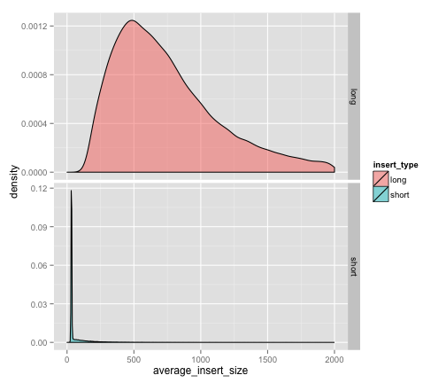

Estimating insert size distribution for KW1 gDNA reads aligned back to TGAC KW1 assembly
========================================================


## Load in data

```r
setwd("~/Desktop/circos_cf_big/")
source("scripts/load.r")
setup_environment()

long_insert = make_dataframe("data/read_gaps_lib2_insert_570.txt", "long")
short_insert = make_dataframe("data/read_gaps_lib1_insert_196.txt", "short")
all = rbind(long_insert, short_insert)
```

## Summarise distributions

```r
summary(long_insert$average_insert_size)
```

```
##    Min. 1st Qu.  Median    Mean 3rd Qu.    Max.    NA's 
##      98     468     697     979    1050   94500       1
```

```r
quantile(long_insert$average_insert_size, c(0.05, 0.95), na.rm = TRUE)
```

```
##     5%    95% 
##  265.1 2313.5
```

```r
summary(short_insert$average_insert_size)
```

```
##    Min. 1st Qu.  Median    Mean 3rd Qu.    Max.    NA's 
##       0      32      34     109      50   36200       3
```

```r
quantile(short_insert$average_insert_size, c(0.05, 0.95), na.rm = TRUE)
```

```
##     5%    95% 
##  30.11 352.12
```


## Plot distributions as density plots


```r
ggplot(all, aes(average_insert_size)) + geom_density(aes(fill = insert_type), 
    alpha = 0.5, ) + scale_x_continuous(limits = c(0, 2000)) + facet_grid(insert_type ~ 
    ., scales = "free_y")
```

```
## Warning: Removed 4176 rows containing non-finite values (stat_density).
## Warning: Removed 271 rows containing non-finite values (stat_density).
```

 


