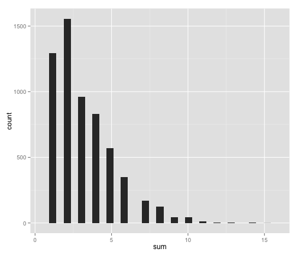
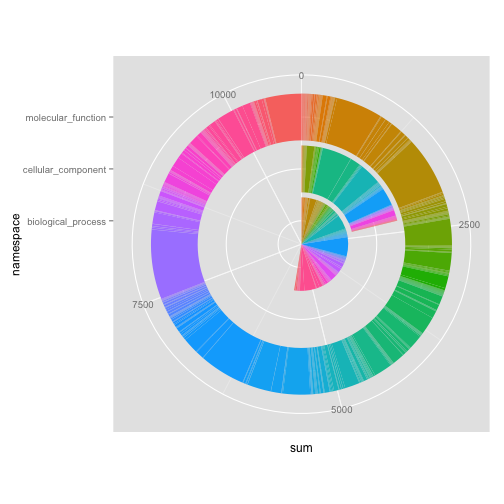

GO Annotation of the TGAC Chalara fraxinea protein predictions
==============================================================

## Introduction

I wanted to analyse the proteins predicted by TGAC, to add GO annotations.

## Methods

I submitted the protein sequences to the InterPRO webservice using the [run_ipr_async](run_ipr_async) script which wraps the EBI provided Perl script [iprscan5_lwp.pl](iprscan5_lwp.pl).

To submit jobs the command line 

* `ruby run_ipr_async Chalara_fraxinea_ass_s1v1_ann_v1.1.protein.faa submit` 

was used and jobs allowed to run overnight. 

Later (within 24 hours, actually the next morning) the same script was used with this command line 

* `ruby run_ipr_async Chalara_fraxinea_ass_s1v1_ann_v1.1.protein.faa get_results` 

to retrieve annotations. The GO terms predicted were parsed as they were retrieved and other data discarded. The file `results.json` was produced.

To reduce the GO terms to the GO slim and add descriptions for those GO slim terms, the EBI QuickGO web service was again used through the wrapper script [get_descriptions.rb](get_descriptions.rb) was run as 

* `ruby get_descriptions.rb results.json` 

to create `terms_and_descriptions.json`.

Separately the domain of the GO terms were mapped. Using the script [add_domain.rb](add_domain.rb) and GO term OBO file [go-basic.obo](go-basic.obo).

These were then loaded into R:


```S
setwd("~/Desktop/go_analysis")
source("functions.R")
setup_environment()

data <- data_frame_from_json_file("terms_and_descriptions.json")
```


## Results

### How many proteins with GO Terms?

```S
length(levels(as.factor(data$gene)))
```

```
## [1] 5965
```


### How many annotations per protein (sum = annotations per protein)?


```S
y <- ddply(data, c("gene"), summarise, sum = sum(count))
ggplot(y, aes(sum)) + geom_histogram()
```

```
## stat_bin: binwidth defaulted to range/30. Use 'binwidth = x' to adjust
## this.
```

 


### How many annotations from each GO category?

```S
y <- ddply(data, c("description", "namespace"), summarise, sum = sum(count))
ggplot(y, aes(namespace, sum, fill = description)) + geom_bar() + theme(legend.position = "none") + 
    coord_polar(theta = "y")
```

```
## Mapping a variable to y and also using stat="bin".  With stat="bin", it
## will attempt to set the y value to the count of cases in each group.  This
## can result in unexpected behavior and will not be allowed in a future
## version of ggplot2.  If you want y to represent counts of cases, use
## stat="bin" and don't map a variable to y.  If you want y to represent
## values in the data, use stat="identity".  See ?geom_bar for examples.
## (Deprecated; last used in version 0.9.2)
```

 


### Is the population of GO terms enriched/depleted relative to a close relative i.e _Blumeria graminis_?

I downloaded the latest GO annotations for the Blumeria genome v3.0 from [the genome project website](http://www.blugen.org/index.php?page=data) and used file `bgh_dh14_v3_0_annotations_gff` as follows to create a count file of GO annotations.

* `ruby get_go_from_gff.rb > blumeria_go_term_counts.txt`

Then these were run through R to summarise. Only 1353 _Blumeria_ terms are available and only 69 overlap between the _H.pseudoalbidus_ and _Blumeria_ . This is not enough to do proper enrichment analysis. The comparisons are summarised

```S
y <- ddply(data, c("term"), summarise, sum = sum(count))
y <- mutate(y, transform, total = sum(sum))
blumeria <- read.table("~/Desktop/go_analysis/blumeria_go_term_counts.txt", 
    sep = "\t", header = FALSE)
colnames(blumeria) <- c("term", "sum", "total")
all <- merge(y, blumeria, by.x = "term", by.y = "term", all.x = TRUE, all.y = TRUE, 
    incomparables = NA)
y <- mutate(all, transform, ratio = (sum.x/total.x)/(sum.y/total.y))
## How many
length(levels(as.factor(y$ratio)))
```

```
## [1] 69
```


The data seem too sparse to be comparable. 
