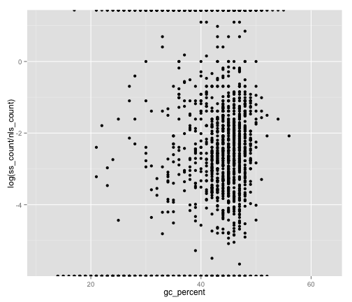

Does secretion signal peptide to nuclear localisation signal ratio vary with assembly scaffold GC Percent?
========================================================

To work out whether the apparently collapsed repeats in the _Hymenoscyphus pseudoalbidus_ genome assembly may contain more secreted proteins and therefore be harbouring an enhanced number of effectors I searched the genome assembly for nucleotide sequences that may code for secretion signals or nuclear localisation signals. To do this I extracted all open-reading frames from the nucleotide sequence, then searched the 6-frame translations of these for sequences predicted to code for secretion signals with SignalP 4 and independently for nuclear localisation signals with NLStradamus.

## Method

* NLStradamus was run with default settings using this [Galaxy Workflow](Galaxy-Workflow-sequence_to_nlstradamus.ga), to create file [nlstradamus_results.tabular](nlstradamus_results.tabular).
* Data were parsed from the results files using the following ruby script with this command line `ruby get_positions.rb nlstradamus_results.tabular `

```ruby
require 'bio'
require 'json'


def get_coords fasta
  fasta.definition =~ /(Cf746836_TGAC_s1v1_scaffold_\d+)_pep.*\s\[(\d+)\s-\s(\d+)\]\s+--HMM=(\d\.\d+)\s+--NNCleavageSite=(\d+)/
  {
    :contig => $1,
    :sequence => fasta.seq,
    :id => fasta.entry_id,
    :start => [$2,$3].sort.first,
    :stop => [$2,$3].sort.last,
    :hmm => $4,
    :nncleavagesite => $5 
  }

end

def get_coords_tab line
  line = line.split(/\s+/)
  #ID     algorithm       score   start   stop    sequence
  line[0] =~ /(Cf746836_TGAC_s1v1_scaffold_\d+)_/;
  {
    :contig => $1,
    :sequence => line[-1],
    :id => line[0],
    :start => line[3].to_i,
    :stop => line[4].to_i,
    :score => line[2].to_f,
    
  }
end
 #get secretion signal data
 sl_json = Bio::FastaFormat.open(ARGV[0]).collect {|z| get_coords z }
 
 #get nuclear signal data
 nls_json = File.open(ARGV[1]).readlines.collect {|z| get_coords_tab z }.to_json
 
 File.open("scaffolds_with_secretory_signal.json", "w").write(sl_json)
 File.open("nls.json", "w").write(nls_json)
 ```

* To identify the number of NLS and SSL in 10kb windows across the genome assembly, and the average GC percentage of sequence in that window, the output JSON files were used in the following script with the command line `ruby ~/Desktop/analyse_frequency.rb --fasta Chalara_fraxinea_TGAC_s1v1_scaffolds.fa --nls nls.json --ss scaffolds_with_secretory_signal.json > nls_ss_gc.csv`

```ruby
require 'pp'
require 'json'
require 'bio'
require 'barmcakes'

args = Arrghs.parse_and_check(
      '--fasta' => 'a fasta file of the genome',
      '--nls' => 'json file of nuclear signal predictions',
      '--ss' => 'json file of secretion peptide predictions'
      )


nls_all = JSON.parse(File.open(args[:nls]).read)
ss_all = JSON.parse(File.open(args[:ss]).read)
seqs = Bio::FastaFormat.open(args[:fasta]).collect {|x| x}

puts ['scaffold','start','stop','nls_count','ss_count','gc_percent'].join("\t")
Bio::DB::FastaLengthDB.new(args[:fasta]).each do |seqid, length|
  nls = nls_all.select {|n| n['contig'] == seqid}

  ss = ss_all.select {|n| n['contig'] == seqid}
  seq = Bio::Sequence::NA.new( seqs.select {|s| s.entry_id == seqid }.first.seq )
  
  step = 10000
  (1..length).step(step) do |window|
    stop = window + step
    stop = length if length - window < step
    nls_count = nls.select {|n| n['start'] > window and n['stop'] < stop + n['sequence'].length }.length
    ss_count = ss.select {|n| n['start'].to_i > window  and n['stop'].to_i < stop + n['sequence'].length }.length
    gc_percent = seq.subseq(window, stop).gc_percent
    puts [seqid, window,stop, nls_count, ss_count, gc_percent].join("\t")
  end
  
end
```

## Results

* These summary data were then loaded into R and a plot generated to show secretion signal occurence relative to nuclear signal occurence at different percent GC. 


```S
source("functions.R")
source("load.R")
ggplot(data, aes(gc_percent, log(ss_count/nls_count))) + geom_point()
```

```
## Warning: Removed 2248 rows containing missing values (geom_point).
```

 


## Conclusion
No correlation between GC percent and secretion signal was observed, indicating no enrichment of secreted peptides in the AT-rich repeat regions of the assembly.
