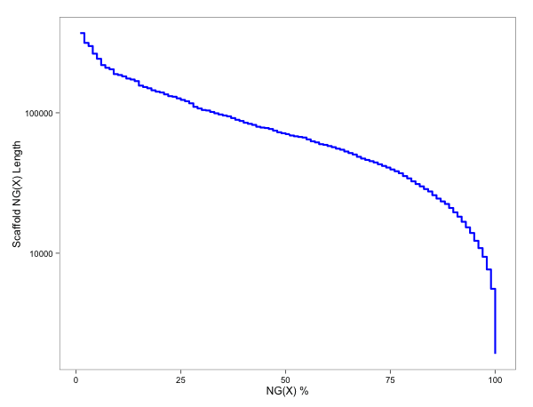

# Scaffold Size Distributions

## NG X of Scaffold Size

NG(X) values for the H.pseudoalbidus scaffold assembly at [this link](https://github.com/ash-dieback-crowdsource/data/blob/master/ash_dieback/chalara_fraxinea/Kenninghall_wood_KW1/assemblies/gDNA/KW1_assembly_version1/Chalara_fraxinea_TGAC_s1v1_scaffolds.fa) were calculated with the script [here](calc_ng_50.rb) with the following command line:

```{bash}
ruby calc_ng_50.rb --fasta ~/src/data/ash_dieback/chalara_fraxinea/Kenninghall_wood_KW1/assemblies/gDNA/KW1_assembly_version1/Chalara_fraxinea_TGAC_s1v1_scaffolds.fa > NGX_chalara.csv
```


To create a plot of NG50 the following R code was used 


```R
	library(ggplot2)
	library(ggthemes)
	
	##load data
	data <- read.csv("NGX_chalara.csv", header=FALSE)
	names(data) <- c("x", "y")
	
	ggplot(data, aes(x,y)) 
	+ geom_step(color="blue",size=1)
	+ scale_y_log10("Scaffold NG(X) Length",breaks=c(10000, 100000),labels=c("10000","100000"))
	+ scale_x_continuous("NG(X) %")
	+ theme_few()

```




